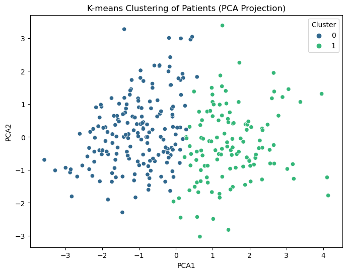
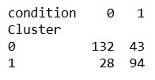

# Heart Disease Risk ML
Machine learning analysis of the UCI Heart Disease dataset by Kaggle using classification, regression, and clustering methods.  
The project explores supervised and unsupervised learning approaches to predict disease status, estimate continuous outcomes, and identify patient risk profiles.

## 📌 Project Overview
Cardiovascular disease is a leading cause of death worldwide. Early detection and risk profiling can support prevention and treatment.  
This project applies multiple machine learning approaches to the UCI Heart Disease dataset:

- **Classification** → Predict whether a patient has heart disease (`condition`)  
- **Regression** → Predict maximum heart rate achieved (`thalach`)  
- **Clustering** → Group patients into low- and high-risk profiles

## 📂 Dataset
- Source: [UCI Machine Learning Repository – Heart Disease Dataset](https://archive.ics.uci.edu/ml/datasets/heart+Disease)  
- Number of records: ~300  
- Number of features: 13 clinical attributes + target (`condition`)  

**Key variables:**
- `age`: Age in years  
- `sex`: (1 = male, 0 = female)  
- `cp`: Chest pain type (0 = typical angina, 1 = atypical, 2 = non-anginal, 3 = asymptomatic)  
- `trestbps`: Resting blood pressure (mm Hg)  
- `chol`: Serum cholesterol (mg/dl)  
- `fbs`: Fasting blood sugar > 120 mg/dl (1 = true, 0 = false)  
- `restecg`: Resting ECG results (0 = normal, 1 = abnormal, 2 = LV hypertrophy)  
- `thalach`: Maximum heart rate achieved  
- `exang`: Exercise-induced angina (1 = yes, 0 = no)  
- `oldpeak`: ST depression induced by exercise  
- `slope`: Slope of ST segment (0 = upsloping, 1 = flat, 2 = downsloping)  
- `ca`: Number of major vessels (0–3) colored by fluoroscopy  
- `thal`: Thalassemia (0 = normal, 1 = fixed defect, 2 = reversible defect)  
- `condition`: (0 = no disease, 1 = disease)

## ⚙️ Methods
## 🔸 Classification: Heart Disease Prediction

We applied several machine learning models to predict the presence of heart disease (`condition`) from patient features under two setups:

- **No Feature Scaling**
- **With Feature Scaling**

---

### 🔹 No Feature Scaling

  
  
  

### 🔹 With Feature Scaling

  
  
  

---

### 📝 Interpretation
- **Logistic Regression** consistently performed best (~83% accuracy, balanced precision/recall).  
- **Random Forest & Decision Tree** worked reasonably well but risked overfitting.  
- **SVM and KNN** showed major improvements when scaling was applied (KNN jumped from ~50% → ~77%).  

📊 **Conclusion:**
Scaling is essential for distance-based models, while tree-based models are scale-invariant. **Logistic Regression was the overall best performer**.

## 🔸 Regression: Predicting Maximum Heart Rate (thalach)

### Why predict maximum heart rate?
- **Medical relevance:** Maximum heart rate achieved (`thalach`) reflects how well a patient’s heart responds to exercise. A reduced peak heart rate is associated with higher risk of coronary artery disease (CAD).  
- **Machine learning insight:** This target is influenced by multiple patient attributes such as age, chest pain type, and exercise-induced angina, making it an interesting prediction task.  
- **Audience clarity:** Easy to explain in simple terms — "predicting how high a patient’s heart rate can go during exercise from their clinical features."  

We also considered `oldpeak` (ST depression) as an alternative target:  
- **Medical relevance:** A strong predictor of CAD severity.  
- **ML challenge:** Harder to predict reliably due to higher variance, but success here would carry deeper clinical meaning.  

---

### Importance of Feature Selection
Not all patient variables contribute equally to predicting maximum heart rate.  
To reduce noise and improve interpretability, we compared **three feature selection strategies**:

1. **Tree-based feature selection (Decision Tree / Random Forest importance)**  
   - Identifies non-linear relationships and variable splits.  
   - Highlighted features such as **age, chest pain type, cholesterol, resting blood pressure, and ST slope**.  

2. **Linear regression (non-scaled coefficients)**  
   - Coefficients indicate direction of influence, but raw magnitudes are biased by variable scale.  
   - Suggested strong effects from **exercise-induced angina, ST slope, and chest pain type**.  

3. **Linear regression (scaled coefficients)**  
   - After scaling, coefficients are directly comparable.  
   - Revealed **age, exercise-induced angina, ST slope, chest pain type, and number of major vessels** as key predictors.  
   - Provided the most interpretable feature ranking.

### Feature Selection Visualizations

**Tree-based (Decision Tree Regression importance):**

**Linear Regression (non-scaled coefficients):**

**Linear Regression (scaled coefficients):**

---
### Regression Results: Actual vs Predicted Max Heart Rate

  
  

  
  

  
  
  

  
  

### Interpretation
- **Linear Regression with selected features (scaled)** explained ~39–42% of variance in maximum heart rate.  
- **Tree-based models (Decision Tree, Random Forest)** performed worse, with negative R² in some cases, suggesting overfitting and poor generalization.  
- **Key takeaway:** Maximum heart rate is partially predictable from baseline clinical features, but significant individual variation remains.  
- The most consistent predictors across methods were:  
  - **Age** (older patients achieve lower max HR)  
  - **Exercise-induced angina** (presence lowers max HR)  
  - **ST slope** (abnormal slopes associated with reduced HR)  
  - **Chest pain type** (asymptomatic/atypical pain linked to lower HR)

---

📊 **Conclusion:**  
Predicting `thalach` provided medical and machine learning insights.  
- Logistic regression performed best for classification (disease prediction).  
- For regression, **Linear Regression with scaled feature selection** offered the clearest and most interpretable model, while tree-based methods struggled.  
 

## 🔸 Clustering Analysis

To explore whether patients can be grouped into different **risk profiles**, we applied **K-means clustering** using key features (age, chest pain type, cholesterol, ST depression, etc.).  
We then projected the clusters into 2D space with PCA for visualization.

- Target: Can we group patients into **low-risk** and **high-risk** profiles without using the disease label?
- Features: age, chest pain type, cholesterol, oldpeak, resting BP, thalach, slope  
- Method: KMeans (k=2), PCA visualization

### Results

- The PCA plot below shows two distinct clusters:

- To validate these clusters, we compared them with the actual disease labels (`condition`) using a crosstab:

### Interpretation

- **Cluster 0 (blue in plot):**  
  - Majority are **no disease (132)** but includes **43 disease cases**.  
  - Represents a group of mostly low-risk patients, but with some misclassified diseased patients.  

- **Cluster 1 (green in plot):**  
  - Majority are **disease cases (94)**, with fewer **no disease cases (28)**.  
  - Represents a high-risk cluster that the algorithm could separate well.  

- **Key insight:**  
  - K-means clustering successfully separated patients into **two clinically meaningful groups**:  
    - A **low-risk cluster** (mainly healthy patients).  
    - A **high-risk cluster** (mainly diseased patients).  
  - While clustering is unsupervised (it doesn’t use the labels), the alignment with actual outcomes shows that patient features carry strong discriminative power.  

📊 **Takeaway:** Even without explicit labels, unsupervised learning (K-means) can uncover patterns that approximate disease risk groups, supporting its potential use in exploratory healthcare analytics.

